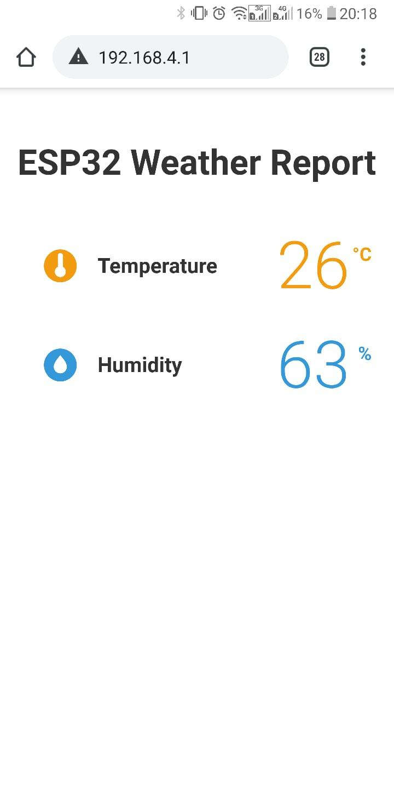

# Weather on chip 
This repository hosts the code for an internet of things devised built by out team for Escendo 2021. 

Weather on chip utilises an ESP32 microcontroller with wifi and bluetooth capabilities to collect information from the connected sensors, and display the relevant metrics to vanilla javascript page hosted on a web server over a wifi network. 

# Sample Operation on the front end 

